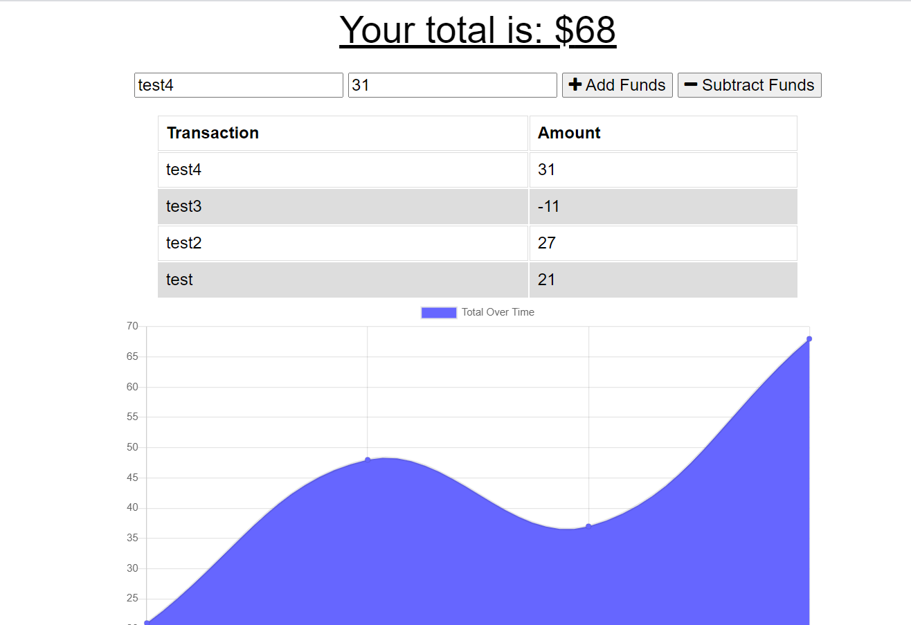

# Offline-Budget  
## Description  
The application will allow the user to record transactions over time, adding and subtracting as needed. MongoDB is used to store information inputed, and the user will be able to record information in offline mode that will be synced when the user is online again.

## Screenshot  

## Link  
https://offline-budget-tracker-boot.herokuapp.com/